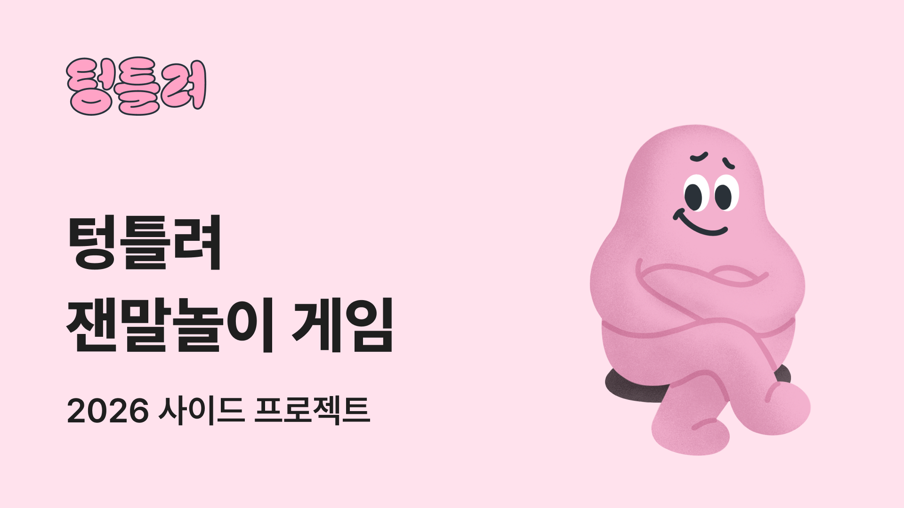

## Tongue-twister (TT)

텅틀려!

**"실수 없이 말할 수 있겠어?"**



## 기술 스택

**Frontend**

- Framework: React (Vite)
- Styling: TailwindCSS
- State Management: Zustand
- Animation: Framer Motion & Lottie

**Infrastructure**

- Deployment: Vercel

## 기술 고려 사항

**2. App-like UX 구현**

Single Page Architecture: 모든 게임 흐름을 상태(State) 기반으로 관리하여, 페이지 새로고침 없는 매끄러운 화면 전환과 게임 데이터의 연속성 보장.

AppEntry: 스플래시 화면 처리 및 핵심 에셋(폰트, 사운드) 프리로딩 로직을 분리하여 네이티브 앱과 유사한 진입 경험 제공.

**3. 연출 (Interactive UI)**

Framer Motion: 버튼 피드백, 페이지 전환, 바텀시트 모션 등 인터랙션을 통해 게임의 몰입감을 극대화.

Design: Tailwind CSS를 활용하여 피그마 디자인 명세를 100% 반영한 UI 구축.

## Project Structure

```
src/
├── assets/           # 폰트, 이미지, 사운드 에셋
├── components/       # UI 컴포넌트 (ui/Button, common/GameButton 등)
├── containers/       # 비즈니스 로직이 포함된 뷰 (Splash, GameBoard 등)
├── hooks/            # useTimer, useSound 등 커스텀 훅
├── store/            # Zustand 전역 상태 (인원, 점수, 모드 관리)
├── styles/           # globals.css (Tailwind v4 테마 변수)
├── types/            # 게임 도메인 타입 정의
└── utils/            # 사운드 매니저 및 게임 엔진 로직
```

## Docs

- [미팅록](./meetings/)
- [AI 컨텍스트](./gemini.md)
